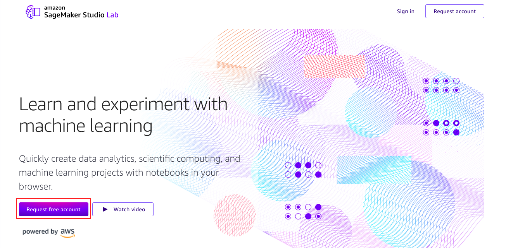
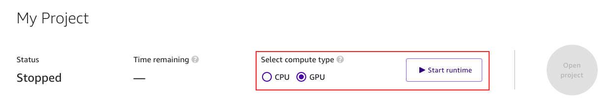
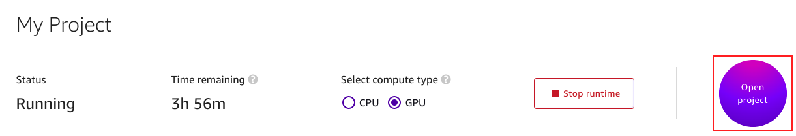
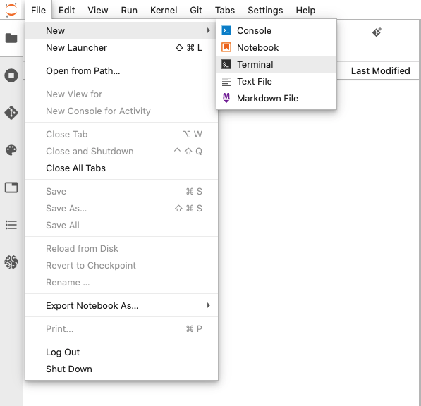
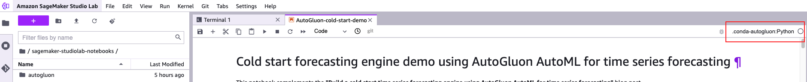
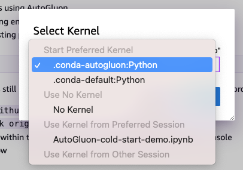

# Build a cold start forecasting engine using AutoGluon AutoML for time series
---

Associated Blog: Link here

[AutoGluon](https://github.com/awslabs/autogluon/) is an open-source Python package to automate machine learning on image, text, and tabular data. Its end-to-end AutoML pipeline allows anybody to easily translate their raw data into [highly accurate predictions](https://arxiv.org/abs/2003.06505), regardless of their Machine Learning (ML) expertise and without the need for extensive data preparation. Specifically, AutoGluon AutoML for [time-series forecasting](http://www.vldb.org/pvldb/vol11/p2102-faloutsos.pdf) beta can be accessed and levearged to build a cold start forecasting engine. 

In this notebook, we will train a cold start forecasting engine using AutoGluon, and demonstrate how to get forecasting on cold start items.

# Repository Structure

* `img` - Images for the AutoGluon-cold-start-demo notebook
* `util` - Folder containing utility functions
    * `__init__.py`
    * `fcst_utils.py`
* `data` - Synthetic electricity dataset
* `AutoGluon-cold-start-demo.ipynb` - Notebook to create cold start forecasting engine using AutoGluon 

# Running this notebook on Amazon SageMaker Studio Lab

The following step guides you on how to set up an Amazon SageMaker Studio Lab account.

## 1. Sign up an Amazon SageMaker Studio Lab account

1. Proceed to the Amazon SageMaker Studio Lab landing page (*https://studiolab.sagemaker.aws/*).

2. Click on "Request free account", populate your information.

3. Wait for account approval, and sign up through the link in the account approval email.

## 2. Log in to Amazon SageMaker Studio Lab and start your project

1. In the top panel of the landing page, select "GPU" as compute type, and click "Start runtime". This will take a few minute.

2. Click on Open Project to launch the Jupyter Lab console.

## 3. Create and activate a custom environment 

1. In the top-left corner of the JupyterLab environment, select File, then New, then Terminal, to launch a new terminal within the JupyterLab environment. 
    

2. We will use this terminal to download the content from github, using the git client. Inside the terminal window, type the following commands:

    $ `cd sagemaker-studiolab-notebooks/`

    $ `git clone https://github.com/aws-samples/amazon-sagemaker-studio-lab-cold-start-forecasting-using-autogluon.git`

3. Identify the "autogluon.yml" file within the repo, and [create a custom envrionment](https://docs.conda.io/projects/conda/en/latest/user-guide/tasks/manage-environments.html#creating-an-environment-from-an-environment-yml-file) specified by the "autogluon.yml" file, and activate the environment.
    
    $ `conda env create -f autogluon.yml`
    
    $ `conda activate autogluon` 

4. Once you are in the custom autogluon environment, download the AutoGluon package.

   $ make sure you are in sagemaker-studiolab-notebooks/ directory
   
   $ `git clone https://github.com/yx1215/autogluon.git`
   
   $ `cd autogluon/`
   
   $ `git checkout --track origin/add_forecasting_predictor`
    
5. Launch the notebook titled `AutoGluon-cold-start-demo.ipynb` and select the custom envrionment `.conda-autogluon:Python` kernel.

## Security

See [CONTRIBUTING](CONTRIBUTING.md#security-issue-notifications) for more information.

## License

This library is licensed under the MIT-0 License. See the LICENSE file.
